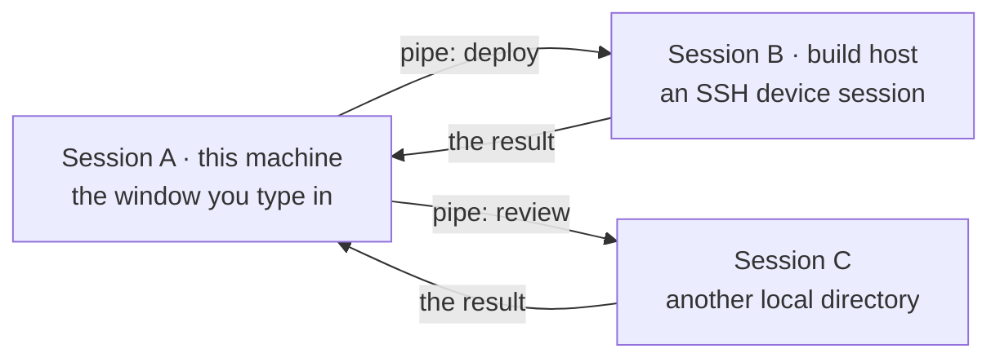
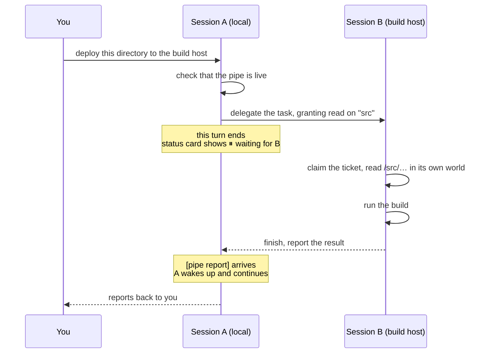
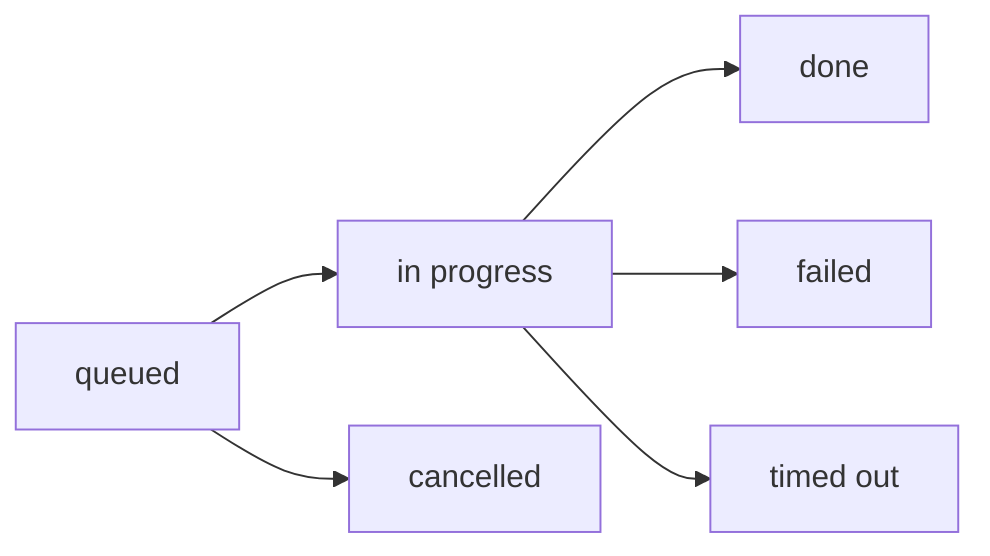
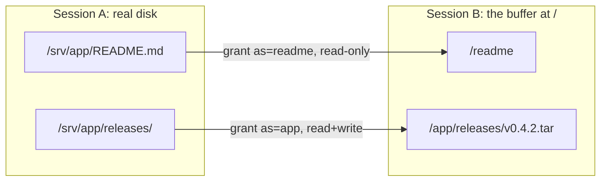
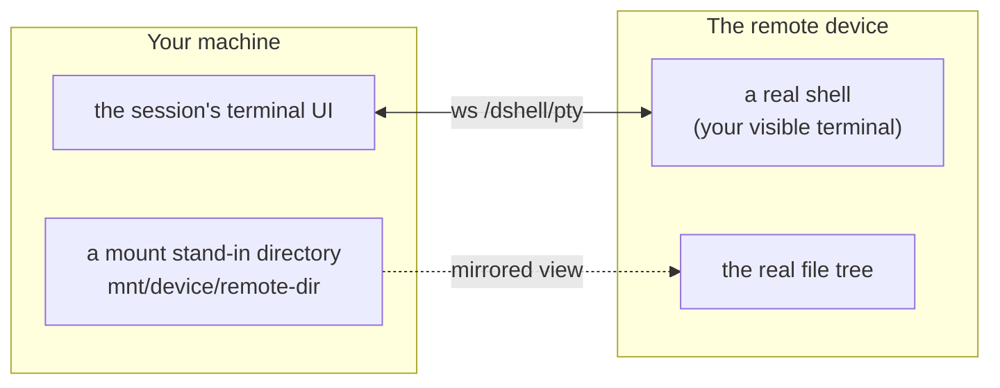

**English** · [简体中文](./README.zh-CN.md)

# dshell — a terminal-first AI workbench

One session is one **terminal timeline**: you type in a real shell, and the AI keeps working on the
same screen. Every command you run and every turn the AI takes land in one column, in the order they
happened. No chat bubbles.


> The screenshots show the Chinese interface. dshell follows dsh's own language setting
> (**Settings → General → Language**), so every dshell surface is available in English too.

dshell is a set of plugins for **dsh** (DeepSeek Harness). It does not modify dsh's source: it plugs
into dsh's documented extension points, so dsh stays upgradeable with upstream.

---

## Contents

- [What it is](#what-it-is)
- [Getting started](#getting-started)
- [A tour of the screen](#a-tour-of-the-screen)
- [Two modes: `$ shell` and `✦ agent`](#two-modes-shell-and-agent)
- [The AI has a terminal of its own](#the-ai-has-a-terminal-of-its-own)
- [Full-screen programs](#full-screen-programs)
- [Input assists: Tab, ↑, →](#input-assists-tab--)
- [**Cross-session collaboration: pipes and the buffer**](#cross-session-collaboration-pipes-and-the-buffer)
- [SSH device sessions](#ssh-device-sessions)
- [Browser and desktop control](#browser-and-desktop-control)
- [Settings](#settings)
- [The status card](#the-status-card)
- [Gesture cheat sheet](#gesture-cheat-sheet)
- [Three examples](#three-examples)
- [Limits worth knowing](#limits-worth-knowing)
- [Docs for developers](#docs-for-developers)

---

## What it is

| What you get | Details |
|---|---|
| A full-bleed terminal | One main shell per session, running real commands — full screen, colours, cursor |
| One merged timeline | Shell output and AI work interleave by time; each AI turn is a collapsible **task block** |
| Two modes | `$ shell` makes Enter run a command, `✦ agent` makes Enter send to the AI — click the pill at the left of the input line to switch |
| The AI's own shell | The AI gets a separate PTY, so it never blocks your foreground program and never steals your terminal |
| Cross-session work | Sessions form **pipes** to delegate tasks to each other and share files by name (the **buffer**) — including across SSH devices |
| Device sessions | Open a session directly on a remote machine: commands, files and the visible terminal all run there |
| Browser and desktop | A local session's AI can drive a headless browser and this machine's desktop; a device session gets neither (see [Browser and desktop control](#browser-and-desktop-control)) |
| Context without retelling | Switching to `✦ agent` automatically carries your last few commands and their output to the AI |

---

## Getting started

Two ways in: install the published plugins into a dsh you already have, or build from this checkout.

### Install into dsh

Prerequisites: **dsh** on the `0.1.5-rc.2` or `0.1.6-alpha.1` line — either the desktop app, or the
CLI (`npm install -g @deepseek-ai/dsh@alpha`) — and **Node 24.21.0** with **pnpm 9.15.0** on `PATH`
(`dsh plugin` forwards to pnpm).

```sh
# 1) dshell itself. One package: the bundle is the patch layer, and it depends
#    on the other eleven.
dsh plugin --profile web add -w @nexus-aethra/dshell-bundle@0.1.3

# 2) the upstream rows the patch names that a stock profile does not ship:
#    the browser-use and computer-use registries, and the desktop driver.
dsh plugin --profile web add -w @deepseek-ai/dsh-browser-use@0.1.6-alpha.1
dsh plugin --profile web add -w @deepseek-ai/dsh-computer-use@0.1.6-alpha.1
dsh plugin --profile web add -w @deepseek-ai/dsh-experimental-computer-use-cua-driver-native@0.1.6-alpha.1

# 3) run
dsh web
```

dsh prints a tokenized URL (for example `http://127.0.0.1:3080/?token=…`). Open it in a browser.

In the **desktop app**, the same install is available as a window: `设置 → 插件`, and give it
`@nexus-aethra/dshell-bundle@0.1.3` (it installs from npmjs and pins the version exactly).

> Skipping step 2 is not fatal — dsh boots and reports `2 entries did not activate` for the two
> computer-use rows, and everything else works. It is listed because the browser and desktop
> capabilities are half of what this release adds.

The bundle carries every dshell package and its own `cordis.patch.yml`, so dsh composes the dshell
rows the moment the package is installed: no profile edit, no config file. `dsh plugin --profile web
list` shows the resulting layer stack.

### Build from this checkout

Prerequisites: the same Node and pnpm, plus an upstream `dsh/` checkout next to this repository (it
is git-ignored here).

```sh
# 1) dsh upstream (once)
cd dsh
pnpm install --no-frozen-lockfile
pnpm run build:lib && pnpm run build:web

# 2) the dshell plugins
cd ..
pnpm install
pnpm --filter "@nexus-aethra/dshell-*" run build

# 3) install into dsh's web profile (once; re-running is safe)
./scripts/install-into-dsh-profile.sh
./scripts/bootstrap-profile-client.sh

# 4) every time
cd dsh && pnpm dsh web
```

Check either install with
`curl -sS -o /dev/null -w "%{http_code}\n" http://127.0.0.1:3080/` — it should answer **401**,
which is dsh's cookie auth gate, not a failure.

> The details and the troubleshooting (why the versions are pinned, how the profile gets filled in,
> the module-loader contract for client bundles) live in [`docs/dshell-setup.md`](docs/dshell-setup.md).

---

## A tour of the screen

The left sidebar holds your sessions, the middle is the terminal timeline, the status card floats in
the top right, and the input line sits at the bottom.

| Area | What you can do |
|---|---|
| **Left sidebar** | Create and switch sessions; `归档` files one away into the `已归档` group; `多选` then batches `恢复` / `删除`; a deleted session first moves to `待删除 · 重启后清除` |
| **Right sidebar: files** | The `文件` tab browses the session's working directory with back/forward; double-clicking a directory makes it the root; **drag a directory onto the terminal** to `cd` there; device sessions also get `打开文件传输` |
| **Status card** | Always in the top right, collapsed to one line; expand it for the AI terminal, subagents, background jobs, buffer transfers and delegation replies |
| **Input line** | The pill on the left switches `$ shell` / `✦ agent`; the text on the right tells you which gestures are live |

The **timeline** is the point: a stretch of shell output occupies one region (a real mini terminal
that scrolls horizontally), and one AI turn occupies one task block. The block's header line says what
it is doing, for how long, and what it has spent; clicking it folds the block into a two-line summary.


---

## Two modes: `$ shell` and `✦ agent`

The pill at the left of the input line shows the current mode. **Click it to switch**, or type a slash
command right in the input box:

| Input | Effect |
|---|---|
| `/shell <command>` | Switch to shell mode and run the command immediately (`/terminal` is an alias) |
| `/agent <text>` | Switch to agent mode and send the text to the AI |
| `/new` | Create a session that inherits the current session's working directory |

In `$ shell` mode:

- `Enter` runs the line, into the foreground process of the main shell
- `Ctrl+C` abandons the line and interrupts the terminal
- `Ctrl+Shift+V` hands the clipboard to the terminal
- Anything starting with `/` still goes down dsh's command channel (`/compact` and friends are untouched)

In `✦ agent` mode Enter simply sends. **Switching to agent mode also attaches your last three
commands and their output** (2 KiB each, with the agent able to page further on demand), so you never
have to explain "that command I just ran failed".

---

## The AI has a terminal of its own

Every session has two shells:

- **Your main shell** — you type, you see it, rendered full width.
- **The AI's shell** — spawned lazily on first need, starting in the directory your shell is in.

Neither can take the other's foreground. The AI cannot type into your terminal; it can only read it
(`dshell_terminal_read`). To watch what it does in its own shell, expand the status card's **`AI 终端`**
row: a read-only live view, with `为 AI 开启一个终端` whenever it is not running.

If dsh's bash tool spawns a persistent shell in the same session, dshell **claims** it as the AI's
terminal, so the model's `bash` calls, `terminal_send`, and the panel you are watching all converge on
one PTY — no more "the panel shows one shell while the model ran its command in another".

---

## Full-screen programs

A program that takes the whole screen — `vim`, `htop`, `less`, a coding TUI such as `minimax-code` —
gets the surface instead of the timeline. The composer steps aside, the terminal fills the column, and
every key goes straight to the program: the arrows, `Tab`, `Escape`, the control chords, and the mouse
reporting it asks for. This is the one case where the composer is not the input line, because a
program that reads the keyboard itself cannot share it with a line editor.

dshell decides this on its own, from two readings of the session's terminal: a foreground program that
is painting the screen (hiding the cursor, opening a synchronized update, enabling mouse reporting),
or the alternate screen that `vim` and friends switch to. Either one is enough. A long command is not
a full-screen program — `npm install` and `sleep 30` keep their timeline.

| | |
|---|---|
| Getting out | the `退出全屏` button on the small bar over the program's own screen — or just quit the program, and the timeline comes back by itself |
| Getting in by hand | the `全屏` button beside the mode chip, for a program the reading misses |
| While it is on | the transcript is not rendered at all, and the program's output is kept out of the timeline on purpose: its repaints would land there as a wall of half-drawn screens. It is still in the session's raw log, so a reconnect replays the screen |
| A device session | only the alternate screen is read there (the local process is `ssh`), so the button is the way in for everything else |

---

## Input assists: Tab, ↑, →

All three live in the `$ shell` input line and each can be switched off independently.

| Gesture | Behaviour |
|---|---|
| `Tab` | Completes the word under the caret, from **what the line says that word is**: a command name in the command position (`dock` + `Tab`, and equally `sudo dock` + `Tab` or `pwd; host` + `Tab`), a directory after `cd`, a path anywhere else (a redirection's target included) — and the subcommands and options the session's own shell knows, so `docker r` + `Tab` offers rename/rm/run and `apt list --` + `Tab` offers the long options. Names come from the session's own world — this machine's `PATH` for a local session, the device's for an SSH session — so the two answer with different names. The comparison **folds ASCII case, but the completion carries the real spelling**: `cd nexus-sh` + `Tab` becomes `Nexus-shell/`, correcting the line as it completes. A single candidate lands directly; several open a floating list (`Tab`/`↑`/`↓` to move, `Enter` to take, `Esc` to close) |
| `↑` | Opens this session's history (`↑↓` to move, `Enter` to take), listing only commands that share a prefix with what you have typed |
| `→` | Shows a **ghost hint** after the caret: the newest command that exactly extends your draft. Each `→` takes **one word** of it, and the ghost disappears with the last word |

The legend to the right of the input line changes with the state, e.g. `→ 采纳一个词 · 继续` or
`Tab 下一个 · ↑↓ 选择 · Enter 填入 · Esc 关闭`. Turn an assist off and its key reverts to the
browser's behaviour (`Tab` moves focus, `→` moves the caret).

---

## Cross-session collaboration: pipes and the buffer

This is what separates dshell from other terminal workbenches: **sessions are not islands.**

Two sessions can be joined by a **pipe**, after which their AIs can delegate tasks to each other and
share files. A pipe can span machines — either end may be a session bound to an SSH device.



### Creating a pipe (only you can)

Click **`管道`** in the left sidebar. The panel has two views:

- **`列表`** — `+ 建立管道`, pick two sessions (optionally a label such as "build host"), `建立管道`.
- **`图`** — sessions are nodes and pipes are edges. Drag from a node's dot **onto another node** to
  create one; click an edge to see its detail or `解除`.

The panel says `只有你能建立管道；agent 没有建连的工具` — connecting is always your move; an AI can only
use pipes that already exist.


### What one delegation looks like

Delegation is **asynchronous**. A busy peer simply queues the request, and the requester does not
block: its turn ends, and it is woken up again when the answer comes back.



The peer sees **only what you send it**: not your other files, not your other sessions. Tickets have a
deadline; a watchdog settles an unanswered one as `已超时` and tells the requester, who can delegate
again or carry on alone.



### The buffer: handing files over by name

A delegation can open files or directories **from your own world** to the peer, each with a name and
read and/or write rights. That name becomes the peer's **buffer path**; the buffer is a tree rooted at
`/`, one per session:



The holder of a grant works through five actions:

| Action | Effect |
|---|---|
| `ls` | With no path, lists every mapped area you hold (name, rights, who it came from); with a path, lists a directory |
| `read` | Reads a text file, paging by line |
| `edit` | Edits that file **in place** inside the granter's world — no copy is made |
| `download` | Copies a buffer file into **your own** world (at a destination you choose) |
| `upload` | Pushes a file from your world into the buffer |

Two rules are worth remembering:

- **The mapping is the contract.** Paths can only land under a name you were granted; absolute paths,
  `..`, and symlink escapes are refused. The AI never needs to know your real paths, and cannot touch
  anything else.
- **The grant holder acts.** To *give* someone a file, grant read and let them `download` it. To
  *receive* one, have them grant write and `upload` it yourself.

Grants are **reference counted**: settling a ticket revokes its grants, and a grant at zero is gone —
nobody has to remember to clean up.

### Big files

Above 32 MiB, `download` and `upload` switch to a **chunked relay**: 16 MiB slices moved one at a
time, then verified end to end by a whole-file sha256. A mismatch is a hard failure and keeps the
intermediate data (1 GiB by default, 4 GiB hard ceiling). Progress shows up live in the status card's
**`⇅ 缓冲区传输`** row, with a percentage and a bar per transfer, even with the panel closed.

### What the detail page shows

Clicking a pipe opens its detail page:


- **缓冲区** — a walkable tree with the same feel as the right sidebar's file browser (crumbs,
  `刷新`, hover highlight); each row says where it came from and with which rights.
- **进行中的请求 / 已结束** — every ticket's state, direction, subject and full reply.
- **生效中的授权** — the grants that are live right now, and the real path each one maps.

The screenshot above is a pipe **after** its task settled: the grants have already been reclaimed, so
the buffer is empty again. That is by design.

---

## SSH device sessions

In the `新会话` dialog, switch **`运行位置`** to **`SSH 设备`**, pick a device and a remote directory.
Creating the session proves the connection with a real ssh round trip first; if it fails, no session
is created.

Devices themselves are registered under **Settings → Plugins → `SSH 设备`**: name, host, port, user,
remote working directory, and either `密钥` (an OpenSSH private key; leave it empty to use your local
ssh agent / `~/.ssh/config`) or `密码`.

- Connections use `IdentitiesOnly=yes`, carrying only that device's own key;
- Passwords go through OpenSSH's askpass hook, never onto a command line;
- Keys and passwords live in `$DSH_HOME/dshell/ssh/keys/`, mode `0600`;
- Host keys are trusted into dshell's own `known_hosts`, leaving your personal file alone. A successful
  `测试` reports `已连接 user@host（system）· N ms` and, when a host key is trusted,
  `主机密钥 SHA256:…（首次信任，请与服务器管理员核对 | 已信任）`.

Once bound to a device, that session's **commands, files and terminal all live on the device**:



Such sessions wear an `SSH` badge in the sidebar. Their right sidebar gains **`打开文件传输`**: two
panes, `本机` and `设备`, and dragging a file or folder from one to the other starts the copy — with
per-item progress, chunk counts, skip counts, and an `覆盖` / `移除` question when something already
exists. (32 MB per file, 20 000 entries or 2 GiB per plan.)

---

## Browser and desktop control

A local session's AI can open pages and read them, and — through dsh's computer-use provider — look at
and drive this machine's own screen and input. Both are **local-session only**, and that is the point
of the rule rather than a limitation to work around:

- A device session runs its shell, its files and its working directory on the remote machine. A
  browser or a desktop living *here* would be operating the wrong machine while claiming to work on
  the session, so a device session gets no browser at all and has the desktop tools taken away.
- The same goes for a session that is still being created for a device: it is treated as a device
  session from the start, never promoted to local.

What that means in practice:

| | |
|---|---|
| The browser | A headless Chromium driven over the pinned Playwright MCP server, one per local session. Page snapshots and console logs are written under `$DSH_HOME/dshell/browser` — not into your working directory |
| Your profile | Untouched: the browser starts `--isolated`, so it never opens your own Chrome profile or its cookies |
| The desktop | dsh's computer-use provider, driving this machine's real screen, windows and input |
| If the browser cannot start | That session simply has no browser tools, and dsh logs why. It is deliberately not a session failure — a missing browser must not cost you the session |
| If the tools are taken away | Applying to a device session at the moment it is created, and again if the desktop's tool catalogue finishes loading later |

Nothing is installed for this beyond step 2 of the install above; the two registries and the desktop
driver are ordinary upstream packages, and dshell supplies the browser provider and the per-session
gating.

---

## Settings

**Settings → Plugins** holds two dshell cards:

| Card | Contents |
|---|---|
| **`终端与输入辅助`** | `终端配色` — `午夜` (default), `柔和`, `神秘`, `森林`, applied instantly; `输入辅助` — the `Tab 补全`, `历史列表`, `智能提示`, `子命令与选项` switches |
| **`SSH 设备`** | The device list, each row offering `测试` / `编辑` / `删除` |

Settings are stored on the host and **shared by every browser on it** — turn an assist off here and it
is off in the other browser too.

---

## The status card

Pinned to the top right, collapsed to a single line until you expand it. Rows appear only when they
have something to say:

| Row | When it shows |
|---|---|
| `计划` | The AI has a todo list; progress and the current step |
| `AI 终端` | The AI's shell is up; expand for the read-only live view |
| `智能体` | Subagents are running; click one to open it |
| `后台任务` | Long-running jobs |
| `缓冲区传输` | Files are moving between worlds, with progress bars |
| `中断点` | You handed this turn to someone else and are waiting (`⏸ 等待 <peer> 回信`); reversible with `撤回` |
| `管道任务` | Another session delegated work to you; lists the pending tickets |
| `连接` | The host websocket dropped; offers `重新连接` |

---

## Gesture cheat sheet

| Where | Action | What it does |
|---|---|---|
| Input line | click `$ shell` / `✦ agent` | switch modes |
| Input line | `Tab` | completion: commands in the command position, directories after `cd`, paths elsewhere (case-insensitive match, real spelling applied) |
| Input line | `↑` | command history list |
| Input line | `→` | take one word of the ghost hint |
| Input line | `Ctrl+C` / `Ctrl+Shift+V` | interrupt / paste into the terminal |
| Input line | `全屏` | hand the whole surface to a full-screen program |
| Terminal | drag a directory in | `cd` the terminal there |
| Timeline | click a task block's header | fold / unfold it |
| Timeline | the right-edge bookmark rail | jump to an AI turn |
| Sidebar | `管道` | open the cross-session pipe panel |
| Sidebar | hover a row | `归档`; archived rows also `恢复` / `删除` |
| Status card | click `▾` | expand the details |

---

## Three examples

### 1. Edit locally, build on a build host

1. Register the build host in Settings; `新会话` → `运行位置: SSH 设备` → pick it → remote directory
   `/srv/order-gateway`.
2. Create a pipe from your local session to that one, labelled "build host".
3. Tell the local session: **"deploy this change to the build host and verify it."** It delegates, the
   build-host session runs the work on its own machine, and the local session wakes up with the answer.
   Your terminal's foreground is never occupied.

### 2. Two sessions review each other (the screenshots above)

1. Create two sessions, `demo` (the code) and `demo-peer` (the release notes), and pipe them together
   with the label "review".
2. In `demo`, say: **"delegate this to demo-peer — map my README.md as `readme` (read-only), have it
   read the file and report a review."**
3. `demo` confirms the pipe, sends `delegate` (with a read-only grant named `readme`), and its turn ends.
4. `demo-peer` wakes up, reads `/readme`, writes the review, and `finish`es the ticket.
5. `demo` receives the `[pipe report]` and continues on its own. The pipe's detail page shows the
   ticket, the full reply, and the grant that was reclaimed once it settled.

This is exactly what produced the two screenshots above — the run is real, not staged.

### 3. Move a large file between machines

1. One session on each end (local and device), joined by a pipe.
2. Have whichever side holds the file `upload` it, or have the side that needs it `download` it, to a
   path in the buffer (say `/app/releases/v0.4.2.tar`).
3. Anything above 32 MiB is chunked and sha256-verified automatically; the status card's
   `⇅ 缓冲区传输` row tracks it, and both sides clean up their temporary slices when it is done.

---

## Limits worth knowing

- **A restart keeps the scrollback but not the PTY process.** Restarting dsh spawns a fresh shell;
  earlier output is restored from the on-disk log (`$DSH_HOME/dshell-pty/`, files `0600` in a `0700`
  directory).
- **That transcript records what you type.** Both output and input are captured, so anything typed at
  an interactive prompt — a password included — lands in the file. It stays on this machine with
  owner-only permissions, but treat it as recorded.
- **A session's working directory is immutable.** The terminal may `cd` freely; the session's own root
  is fixed. A different directory means `/new`.
- **Deleting a session takes two steps.** After `删除` it sits in `待删除`, and its log is cleared at
  the **next dsh start**; `取消` reverses it until then.
- **One browser connection per session.** A second websocket binding to the same session is refused.
- **Archived is not deleted.** An archived session stays in the pipe graph (it can still be a valid
  endpoint); only deletion removes it.
- **Browser and desktop control are local-session only.** A device session gets neither, on purpose:
  both would act on this machine while the session works on another. The install note above lists
  the two upstream packages that make the desktop half available at all.
- **Full-screen mode reads the foreground on this machine only.** A device session is detected by the
  alternate screen alone, so a full-screen program that does not switch buffers needs the `全屏`
  button there. The reading is Linux's: `dsh web` on macOS or Windows has the button and nothing else.
- The pipe panel refreshes by polling (about every 3 seconds) — there is no push channel. In-flight
  transfers refresh the status card once a second.

---

## Docs for developers

| Doc | Read it when |
|---|---|
| [`docs/dshell-design.md`](docs/dshell-design.md) | You want the goal, the non-goals and the eleven design decisions (including why this is not a chat window) |
| [`docs/dshell-architecture.md`](docs/dshell-architecture.md) | Before writing code: the ws protocol, the Cordis extension points, package layout, CSS conventions |
| [`docs/dshell-packages.md`](docs/dshell-packages.md) | You need to know which plugin owns a feature |
| [`docs/dshell-roadmap.md`](docs/dshell-roadmap.md) | The phase plan and each phase's acceptance check |
| [`docs/dshell-setup.md`](docs/dshell-setup.md) | Setting up a machine, troubleshooting, build order |
| [`docs/README.md`](docs/README.md) | The documentation index and its update rules |

Twelve packages (`@nexus-aethra/dshell-*`), published together: `std` (contracts), `storage` (storage
engines), `bundle` (the single patch layer), `conversation`, `terminal-bridge`, `mode`, `commands`,
`workspace`, `files`, `ssh`, `buffer`, `host-tools` (the browser provider and the per-session gating of
the machine's own capabilities).

## License

MIT, see [`LICENSE`](LICENSE).
