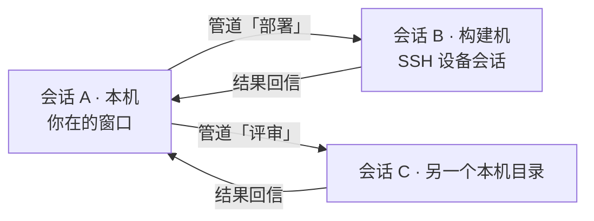
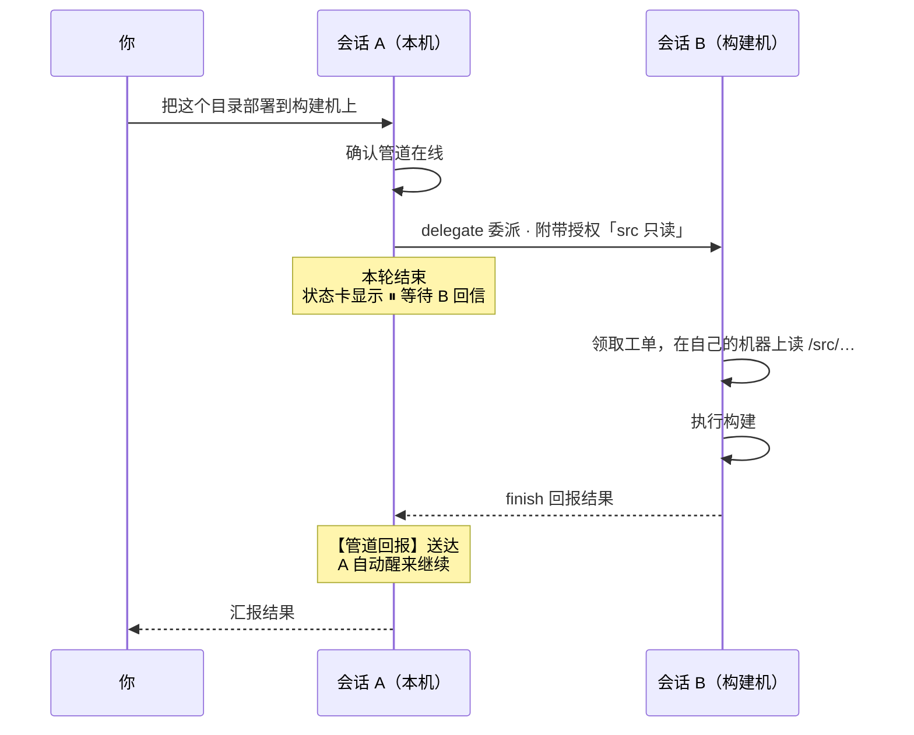
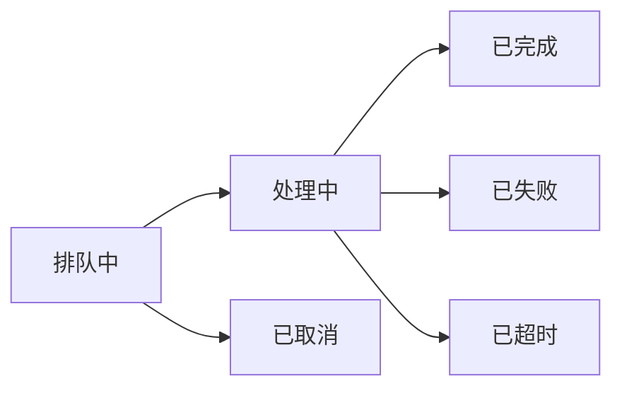
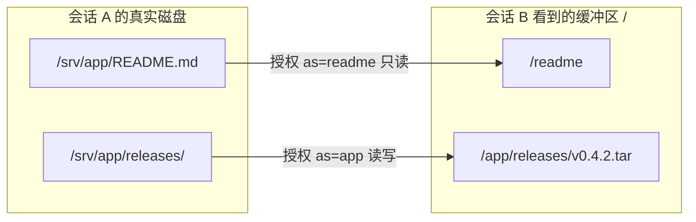
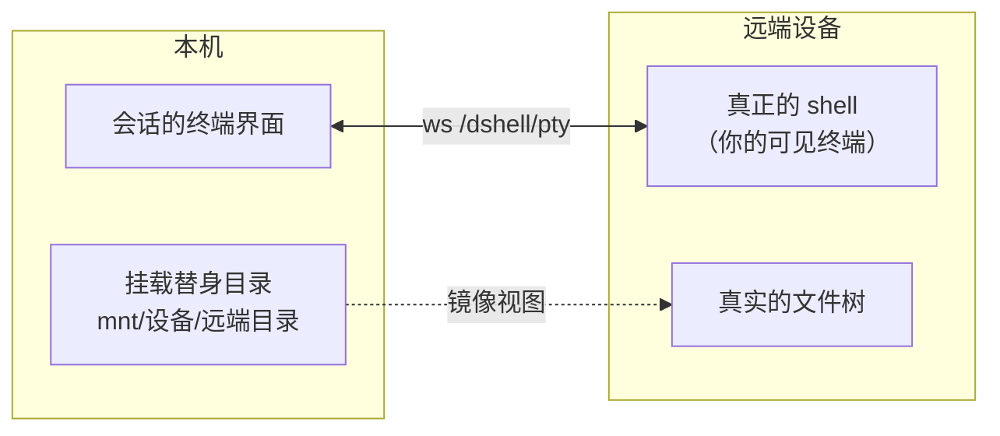

[English](./README.md) · **简体中文**

# dshell — 终端优先的 AI 工作台

一个会话就是一条**终端时间线**：你在真正的 shell 里敲命令，AI 在同一个屏幕上接着干活。
AI 的每一轮工作、你敲的每一条命令，按发生的先后排成一列，没有聊天气泡。


> 界面截图是中文的。dshell 跟随 dsh 自身的语言设置（**设置 → 通用设置 → 语言**），切到 English 后同一套界面也是英文。

dshell 是 **dsh**（DeepSeek Harness）的一组插件。它不修改 dsh 的源码，全部通过 dsh 公开的扩展点接入，
所以 dsh 随时可以跟着上游升级。

---

## 目录

- [它是什么](#它是什么)
- [快速开始](#快速开始)
- [界面速览](#界面速览)
- [两种模式：`$ shell` 与 `✦ agent`](#两种模式-shell-与-agent)
- [AI 有自己的终端](#ai-有自己的终端)
- [全屏程序](#全屏程序)
- [输入辅助：Tab、↑、→](#输入辅助tab--)
- [**多会话协作：管道与缓冲区**](#多会话协作管道与缓冲区)
- [SSH 设备会话](#ssh-设备会话)
- [浏览器与桌面操作](#浏览器与桌面操作)
- [设置](#设置)
- [状态卡](#状态卡)
- [手势速查](#手势速查)
- [三个例子](#三个例子)
- [边界与注意](#边界与注意)
- [面向开发者的文档](#面向开发者的文档)

---

## 它是什么

| 你会得到 | 说明 |
|---|---|
| 一个全幅终端 | 每个会话一个主 shell，直接跑真正的命令，全屏、有颜色、有光标 |
| 一条合并时间线 | shell 的输出和 AI 的工作按时间穿插；AI 的每一轮是一个可折叠的「任务块」 |
| 两个模式 | `$ shell` 让 Enter 执行命令，`✦ agent` 让 Enter 交给 AI，点一下输入框左侧的胶囊即可切换 |
| AI 自己的 shell | AI 有独立的 PTY，不会被你的前台程序挡住，也不会抢你的终端 |
| 跨会话协作 | 会话之间可以建立**管道**，互相委派任务、按名字共享文件（**缓冲区**），包括隔着 SSH 设备 |
| 设备会话 | 直接把一个会话开到远程机器上；命令、文件、终端都在设备上执行 |
| 浏览器与桌面 | 本机会话里的 AI 可以驱动一个无头浏览器，也能操作这台机器的桌面；设备会话两者都拿不到（见[浏览器与桌面操作](#浏览器与桌面操作)） |
| 本地可读的上下文 | 切到 `✦ agent` 时，AI 自动带上你终端里最近几条命令及输出，不用你复述 |

---

## 快速开始

有两条路：把已发布的插件装进你现有的 dsh，或者从本仓库自己构建。

### 装进 dsh

前置：**dsh**（`0.1.5-rc.2` 或 `0.1.6-alpha.1` 这条线都行）——桌面版，或者命令行版
（`npm install -g @deepseek-ai/dsh@alpha`）；以及 `PATH` 上的 **Node 24.21.0** 与 **pnpm 9.15.0**
（`dsh plugin` 是转发给 pnpm 执行的）。

```sh
# 1) dshell 本体。只装一个包：bundle 就是 patch 层，另外十一个由它依赖带入。
dsh plugin --profile web add -w @nexus-aethra/dshell-bundle@0.1.3

# 2) patch 里点名、但原版 profile 不带的上游包：浏览器与计算机使用的注册表，以及桌面驱动。
dsh plugin --profile web add -w @deepseek-ai/dsh-browser-use@0.1.6-alpha.1
dsh plugin --profile web add -w @deepseek-ai/dsh-computer-use@0.1.6-alpha.1
dsh plugin --profile web add -w @deepseek-ai/dsh-experimental-computer-use-cua-driver-native@0.1.6-alpha.1

# 3) 启动
dsh web
```

dsh 启动后会打印一个带 token 的地址（例如 `http://127.0.0.1:3080/?token=…`），用浏览器打开即可。

**桌面版**里同样的事情有一个窗口入口：`设置 → 插件`，填
`@nexus-aethra/dshell-bundle@0.1.3`（它从 npmjs 安装，并精确锁定版本）。

> 跳过第 2 步不会致命——dsh 照样启动，只是为两条 computer-use 行报
> `2 entries did not activate`，其余功能都在。之所以列出来，是因为浏览器与桌面能力正是这次发布的
> 一半内容。

bundle 里带着全部 dshell 包和它自己的 `cordis.patch.yml`，所以包装好的那一刻 dsh 就把它组装进去了：
不用改 profile、不用写配置文件。`dsh plugin --profile web list` 能看到最终的层叠结果。

### 从这份检出构建

前置：同样的 Node 与 pnpm，外加一份 `dsh/` 上游检出（放在本仓库旁即可，`.gitignore` 已忽略它）。

```sh
# 1) dsh 上游（一次性）
cd dsh
pnpm install --no-frozen-lockfile
pnpm run build:lib && pnpm run build:web

# 2) dshell 插件
cd ..
pnpm install
pnpm --filter "@nexus-aethra/dshell-*" run build

# 3) 装进 dsh 的 web profile（一次性；重复执行是安全的）
./scripts/install-into-dsh-profile.sh
./scripts/bootstrap-profile-client.sh

# 4) 每次启动
cd dsh && pnpm dsh web
```

两种装法都可以这样验收：`curl -sS -o /dev/null -w "%{http_code}\n" http://127.0.0.1:3080/` 应当
返回 **401**（那是 dsh 的 cookie 鉴权门，不是错误）。

> 细节和排错（版本为何这样钉、profile 是怎么被填充的、客户端 bundle 的加载约定）都在
> [`docs/dshell-setup.md`](docs/dshell-setup.md)。

---

## 界面速览

**主视图**：左侧是会话列表，中间是终端时间线，右上角是状态卡，底部是输入行。

| 区域 | 你能做什么 |
|---|---|
| **左侧边栏** | 新建会话、在会话间切换；`归档` 收起到「已归档」分组；`多选` 后可批量 `恢复` / `删除`；删除的会话先进入「待删除 · 重启后清除」 |
| **右侧文件浏览器** | 「文件」页签列出会话工作目录，可前进后退；双击目录把它设为根；把目录**拖到终端上**就等于在这个终端里 `cd` 过去；设备会话还有「打开文件传输」 |
| **状态卡** | 常驻右上角，折叠成一行；展开可见 AI 终端、子智能体、后台任务、缓冲区传输、委派回信等 |
| **输入行** | 左侧胶囊切换 `$ shell` / `✦ agent`，右侧实时提示当前可用的手势 |

**时间线**：shell 的输出占一段（一个真正的小终端，可横向滚动），AI 的一轮占一个任务块。
任务块的头部一行告诉你它现在在干什么、干了多久、花了多少 token；点一下可折叠成两行摘要。


---

## 两种模式：`$ shell` 与 `✦ agent`

输入行左侧的胶囊显示当前模式，**点它即可切换**，也可以直接在输入框里打斜杠命令：

| 输入 | 效果 |
|---|---|
| `/shell <命令>` | 切到 shell 模式并把命令立刻执行（`/terminal` 是它的别名） |
| `/agent <话>` | 切到 agent 模式并把这句话发给 AI |
| `/new` | 新建会话，沿用当前会话的工作目录 |

在 `$ shell` 模式下：

- `Enter` 执行这一行（进入主 shell 的前台进程）
- `Ctrl+C` 放弃这一行并向终端发中断
- `Ctrl+Shift+V` 把剪贴板内容交给终端
- 以 `/` 开头的内容仍然走 dsh 的命令通道（`/compact` 等原样保留）

在 `✦ agent` 模式下 Enter 就是「发消息」，和普通对话一样。**切到 agent 模式时，dshell 会自动附带
你终端里最近三条命令及输出**（每条最多 2 KiB，超长可让 AI 用工具按需翻页），所以你不必解释
「我刚才跑的那条为什么失败了」。

---

## AI 有自己的终端

每个会话里有两个 shell：

- **你的主 shell** —— 你敲，你看见，全幅渲染。
- **AI 的 shell** —— 第一次需要时才启动，启动目录跟着你的 shell 走。

两者互不抢前台。AI 不能往你的终端里打字，只能读（`dshell_terminal_read`）；你想看它在自己那个
shell 里干了什么，展开状态卡的 **`AI 终端`** 行，那里是一条只读的实时画面，可随时 `为 AI 开启一个终端`。

如果 dsh 的 bash 工具在同一个会话里另开了一个持久 shell，dshell 会把它**认领**成 AI 的终端，
让模型的 bash 调用、`terminal_send` 和你看到的这块画面收敛到同一个 PTY 上 —— 不会出现「面板里
一个 shell、模型命令跑在另一个 shell」的错位。

---

## 全屏程序

吃掉整块屏幕的程序 —— `vim`、`htop`、`less`，以及 `minimax-code` 这类编码 TUI —— 拿到的是画面本身，
而不是时间线。输入框让位，终端铺满整列，每一个按键都直接交给程序：方向键、`Tab`、`Escape`、各种
Ctrl 组合，以及它自己开启的鼠标上报。这是输入框唯一不是「输入行」的情形，因为一个自己读键盘的程序
没法跟一个读整行的编辑器共用键盘。

dshell 自己判断这件事，依据是对该会话终端的两个读数：一个正在**绘制屏幕**的前台程序（隐藏光标、
开启同步刷新、打开鼠标上报），或者 `vim` 这类程序切换过去的备用屏幕。两者满足其一即可。长命令不算
全屏程序 —— `npm install`、`sleep 30` 都照旧留在时间线上。

| | |
|---|---|
| 怎么退出 | 程序画面右上角小条上的 `退出全屏` 按钮 —— 或者直接退出程序，时间线会自己回来 |
| 手动进入 | 模式胶囊旁边的 `全屏` 按钮，用于读数漏掉的程序 |
| 全屏期间 | 会话记录不再渲染，程序的输出也被刻意挡在时间线之外：它的重绘会在时间线上堆成一片画到一半的屏幕。字节仍在会话的原始日志里，所以重连能重放这块画面 |
| 设备会话 | 那里只读备用屏幕（本地进程是 `ssh`），其余情况用按钮进入 |

---

## 输入辅助：Tab、↑、→

三个手势都在 `$ shell` 模式的输入行里生效，每个都可以单独关掉。

| 手势 | 行为 |
|---|---|
| `Tab` | 按**这一行说这个词是什么**来补全：命令位补命令名（`dock` + `Tab`，`sudo dock` + `Tab`、`pwd; host` + `Tab` 同样），`cd` 之后只补目录，其余位置补路径（重定向的目标也算），以及本会话自己的 shell 才知道的子命令与选项（`docker r` + `Tab` 给出 rename/rm/run，`apt list --` + `Tab` 给出长选项）。名字来自会话自己的世界——本地会话是本机 `PATH`，SSH 会话是设备上的，所以两边给出的名字并不相同。**大小写不折叠地比较，但补出来的是真实拼写**：`cd nexus-sh` + `Tab` 会补成 `Nexus-shell/`，顺手把这一行改对。唯一候选直接落地，多个候选弹出浮层（`Tab`/`↑`/`↓` 切换、`Enter` 填入、`Esc` 关闭） |
| `↑` | 打开本会话历史（`↑↓` 选择、`Enter` 填入），只列与当前草稿同前缀的命令 |
| `→` | 光标后显示**虚影提示**：最近一条与草稿完全同前缀的命令，按 `→` **逐词采纳**，采完即消失 |

输入行右侧图例会跟着变，例如 `→ 采纳一个词 · 继续`、`Tab 下一个 · ↑↓ 选择 · Enter 填入 · Esc 关闭`。
把某个开关关掉后，那个键就回到浏览器默认行为（`Tab` 移动焦点、`→` 移动光标）。

---

## 多会话协作：管道与缓冲区

这是 dshell 与其他终端工作台区别最大的部分：**会话不是孤岛**。

两个会话之间可以拉一条**管道**，然后各自的 AI 就能互相委派任务、共享文件。链路可以跨机器 ——
其中一端完全可以是绑在 SSH 设备上的会话。



### 建立管道（只有你能建）

点左侧边栏的 **`管道`**，面板有两个视图：

- **`列表`** —— `+ 建立管道`，选两个会话（可选一个标签，例如「部署机」），`建立管道`。
- **`图`** —— 会话是节点，管道是连线。从节点边缘的圆点**拖到另一个节点**就建好了；双击连线可看详情或 `解除`。

面板上写着 `只有你能建立管道；agent 没有建连的工具` —— 建连始终是你的动作，AI 只能使用已存在的管道。


### 一次委派的全过程

委派是**异步**的：被委派方在忙也没关系，请求会排队；发起方不会阻塞等待，它可以结束本轮，
对方回报后自动被唤醒继续。



被委派方**只看得到你发给它的内容**：它不知道你的其他文件、其他会话。工单有期限，超时会被看门狗
判为 `已超时`，发起方会收到通知，可以重新委派或自己继续。



### 缓冲区：把文件按名字交给对方

委派时可以把**自己世界里的文件或目录**开放给对面，每份授权带一个名字和读/写权限。
这个名字就变成对方的**缓冲区路径**，缓冲区是一棵以 `/` 为根的树，一个会话一棵：



拿到授权的一方用五个动作在缓冲区里干活：

| 动作 | 作用 |
|---|---|
| `ls` | 不带路径时列出自己拿到的所有映射区（名字、权限、来自谁）；带路径则列目录 |
| `read` | 读一个文件的文本，可按行翻页 |
| `edit` | 在**原位**改授权方世界里的那个文件（不产生副本） |
| `download` | 把缓冲区里的文件搬到**自己的**世界（可指定落点） |
| `upload` | 把自己世界的文件推进缓冲区 |

两条规则值得记住：

- **映射就是合同**：路径只能落在被授权的名字之下，绝对路径、`..`、软链接逃逸都会被拒绝。
  AI 不需要知道你机器上的真实路径，也改不了别的地方。
- **持有授权的一方动手**：要**给**别人文件，就开只读授权、让对方 `download`；要**收**文件，
  就由对方开写权限、由你 `upload`。

授权按**引用计数**回收：工单结算时自动撤销，计数归零就失效 —— 不需要谁记得去清理。

### 大文件

`download` / `upload` 超过 32 MiB 时自动切换成**分块中继**：按 16 MiB 切片、逐块搬运，
落地后按整个文件的 sha256 校验，校验不过就算失败并保留中间数据（默认上限 1 GiB，硬上限 4 GiB）。
进度实时出现在状态卡的 **`⇅ 缓冲区传输`** 行里，带百分比和进度条，面板关着也照常显示。

### 面板里能看到什么

点开一条管道，就是它的详情页：


- **缓冲区** —— 一棵可以走的树，和右侧文件浏览器同一套操作手感（面包屑、`刷新`、悬停高亮）；
  每一行都写着它来自谁、什么权限。
- **进行中的请求 / 已结束** —— 每张工单的状态、方向、主题和回报全文。
- **生效中的授权** —— 当前活着的授权，以及每份授权映射了哪个真实路径。

上图这份详情是任务**结算之后**的样子：授权已经自动回收，所以缓冲区又是空的 —— 这是设计如此。

---

## SSH 设备会话

在 `新会话` 对话框里把 **`运行位置`** 切到 **`SSH 设备`**，选设备、填远端目录，创建时 dshell 会用一次
真实的 ssh 往返先验证连通性，验证不过不会把会话建出来。

设备本身在 **设置 → 插件 → `SSH 设备`** 里登记：名称、host、端口、用户名、远端工作目录，
登录方式可选 `密钥`（OpenSSH 私钥，留空则用你本机 ssh agent / `~/.ssh/config`）或 `密码`。

- 连接用 `IdentitiesOnly=yes`，只带这台设备自己的钥匙；
- 密码通过 OpenSSH 的 askpass 传递，不出现在命令行里；
- 密钥与密码写在 `$DSH_HOME/dshell/ssh/keys/`，权限 `0600`；
- 主机密钥记到 dshell 自己的 `known_hosts`，不动你个人的那份。`测试` 成功时会显示
  `已连接 user@host（系统）· N ms` 和 `主机密钥 SHA256:…（首次信任，请与服务器管理员核对 | 已信任）`。

绑定设备后，这个会话的**命令、文件和终端都在设备上**：



侧边栏里这类会话带一个 `SSH` 徽章。设备会话的右侧文件浏览器会多出 **`打开文件传输`**：
左右两栏分别是 `本机` 和 `设备`，把文件或文件夹从一侧拖到另一侧即开始复制，逐项显示进度、分块、
跳过计数，遇到同名会问你 `覆盖` 还是 `移除`。（单文件上限 32 MB，单次计划上限 20 000 项 / 2 GiB。）

---

## 浏览器与桌面操作

本机会话里的 AI 可以打开网页并读取内容；经由 dsh 的 computer-use provider，它还能看和操作这台
机器真实的屏幕与输入。两者都**只给本机会话**，这是一条规则而不是待绕过的限制：

- 设备会话的 shell、文件和工作目录都在远端机器上。一个长在**这里**的浏览器或桌面，会在声称服务于
  该会话的同时操作错误的机器——所以设备会话干脆没有浏览器，桌面工具也会被逐会话收回。
- 正在为某台设备创建中的会话同样算设备会话：从创建那一刻起就按设备处理，不会先当成本机。

具体表现：

| | |
|---|---|
| 浏览器 | 无头 Chromium，经由钉住版本的 Playwright MCP server 驱动，每个本机会话一个。页面快照与控制台日志写在 `$DSH_HOME/dshell/browser` 下，不会落到你的工作目录里 |
| 你的浏览器配置 | 不受影响：浏览器以 `--isolated` 启动，不会打开你自己的 Chrome 配置或其 cookie |
| 桌面 | dsh 的 computer-use provider，操作这台机器真实的屏幕、窗口与输入 |
| 浏览器起不来时 | 那个会话就没有浏览器工具，dsh 会记下原因。这里刻意不当作会话失败——装不上浏览器不该让你丢掉会话 |
| 工具是怎么被收回的 | 在会话创建的那一刻就施加；若桌面工具清单加载得更晚，加载完会再施加一次 |

除了上面安装的第 2 步，这里不需要额外装什么：两张注册表和桌面驱动都是普通的上游包，dshell 提供的
是浏览器 provider 和「按会话决定给不给」这件事。

---

## 设置

**设置 → 插件** 里有 dshell 的两张卡：

| 卡片 | 内容 |
|---|---|
| **`终端与输入辅助`** | `终端配色` —— `午夜`（默认）、`柔和`、`神秘`、`森林`，选择立即生效；`输入辅助` —— `Tab 补全`、`历史列表`、`智能提示`、`子命令与选项` 四个开关 |
| **`SSH 设备`** | 设备清单，每行可 `测试` / `编辑` / `删除` |

设置保存在主机上，**同一主机的所有浏览器共用**（关掉某个辅助键，换台浏览器也一样）。

---

## 状态卡

常驻右上角，平时折叠成一行，点开才展开细节。它只在有内容时才显示对应行：

| 行 | 出现时机 |
|---|---|
| `计划` | AI 列了待办，显示完成度与当前阶段 |
| `AI 终端` | AI 的 shell 开起来了，展开是只读实时画面 |
| `智能体` | 派生了子智能体，可点进某一个 |
| `后台任务` | 有长任务在跑 |
| `缓冲区传输` | 有文件在跨世界搬运，带进度条 |
| `中断点` | 你这一轮把活交给了别人、正在等回信（`⏸ 等待 <对方> 回信`），可 `撤回` |
| `管道任务` | 别的会话派活给你，列出了待处理工单 |
| `连接` | 与主机的 ws 断了，可 `重新连接` |

---

## 手势速查

| 位置 | 操作 | 效果 |
|---|---|---|
| 输入行 | 点击 `$ shell` / `✦ agent` | 切换模式 |
| 输入行 | `Tab` | 补全：命令位补命令名、`cd` 后补目录、其余位置补路径（大小写不敏感比较，按真实拼写落地） |
| 输入行 | `↑` | 历史命令列表 |
| 输入行 | `→` | 采纳一格虚影提示 |
| 输入行 | `Ctrl+C` / `Ctrl+Shift+V` | 中断 / 粘贴到终端 |
| 输入行 | `全屏` | 把整块画面交给一个全屏程序 |
| 终端 | 把目录拖进来 | 在这个终端里 `cd` 过去 |
| 时间线 | 点任务块头部 | 折叠 / 展开 |
| 时间线 | 右侧书签轨 | 跳到某一轮 AI 的工作 |
| 侧边栏 | `管道` | 打开跨会话管道面板 |
| 侧边栏 | 行上悬停 | `归档`；已归档行还有 `恢复` / `删除` |
| 状态卡 | 点 `▾` | 展开细节 |

---

## 三个例子

### 例 1：本机改代码，构建机上跑构建

1. 设置里登记构建机；`新会话` → `运行位置: SSH 设备` → 选它 → 远端目录 `/srv/order-gateway`。
2. 在本地会话里建一条到构建机会话的管道，标签「构建机」。
3. 对本地会话说：**「把这次改动部署到构建机上验证」**。它会委派出去，构建机会话在自己的机器上
   执行，结果回信后本地会话自动醒来汇报。整个过程你的终端前台不会被占用。

### 例 2：两个会话互相评审（本文截图的场景）

1. 建两个会话 `demo`（代码）和 `demo-peer`（发布说明），拉一条管道，标签「评审」。
2. 在 `demo` 里说：**「把这个任务委派给 demo-peer：我这边 README.md 映射成 readme（只读），
   让它读完后写一份评审意见回报。」**
3. `demo` 确认管道在线 → `delegate` 发出（附带 `as=readme` 的只读授权）→ 本轮结束。
4. `demo-peer` 被唤醒，用 `/readme` 读到文件，写下意见，`finish` 回报。
5. `demo` 收到 `【管道回报】` 自动继续。你在管道详情页能看到工单、回报全文，以及结算后自动回收的授权。

这正是上面那两张截图发生的过程。

### 例 3：跨机器搬一个大文件

1. 两端各一个会话（本机 + 设备），中间拉一条管道。
2. 让持有文件那侧 `upload`，或让需要文件那侧 `download`，目标路径写在缓冲区里（例如 `/app/releases/v0.4.2.tar`）。
3. 文件超过 32 MiB 会自动分块 + sha256 校验；状态卡的 `⇅ 缓冲区传输` 行显示进度，完成后两侧的
   临时分片都会被清掉。

---

## 边界与注意

- **重启不保留 PTY 进程，但保留回滚缓冲。** 重启 dsh 会重新起一个 shell，之前的输出会从磁盘日志里
  恢复出来（`$DSH_HOME/dshell-pty/`，权限 `0600`，目录 `0700`）。
- **终端转录包含你键入的内容。** 日志既记录输出也记录输入，因此在交互式提示符里输入的密码等敏感内容
  也会落进这份文件。它只在本机、权限是 owner-only，但请按「这里会被记下来」来使用。
- **会话的工作目录不可变。** 终端可以随便 `cd`，但会话本身的根目录固定；换目录就 `/new`。
- **删除会话是两步的。** `删除` 之后会话进入「待删除」，日志在**下次启动 dsh** 时才真正清除，
  期间可以 `取消` 撤销。
- **一个会话一个浏览器连接。** 同时开两个 ws 连同一个会话会被拒绝。
- **归档 ≠ 删除。** 归档的会话仍在管道图里（它可能还是一条合法管道的一端），删除才会把它摘掉。
- **浏览器与桌面只给本机会话。** 设备会话两者都没有，这是刻意的：两者都会作用在这台机器上，而会话
  的活干在另一台。桌面这一半能不能用，取决于安装第 2 步里那两个上游包。
- **全屏模式只在本机读前台进程。** 设备会话只能靠备用屏幕判断，所以不切备用屏幕的全屏程序在那里
  要用 `全屏` 按钮进入。这个读数也只适用于 Linux：在 macOS 或 Windows 上跑 `dsh web` 只有按钮可用。
- 管道面板靠轮询刷新（约 3 秒一次），没有推送通道；正在传输的文件会以 1 秒的节奏刷新状态卡。

---

## 面向开发者的文档

| 文档 | 什么时候读 |
|---|---|
| [`docs/dshell-design.md`](docs/dshell-design.md) | 目标、非目标与十一条设计决策（含为什么不是一个聊天窗口） |
| [`docs/dshell-architecture.md`](docs/dshell-architecture.md) | 写代码前：ws 协议、Cordis 扩展点、包布局、CSS 约定 |
| [`docs/dshell-packages.md`](docs/dshell-packages.md) | 查某个功能属于哪个插件 |
| [`docs/dshell-roadmap.md`](docs/dshell-roadmap.md) | 阶段计划与每个阶段的验收标准 |
| [`docs/dshell-setup.md`](docs/dshell-setup.md) | 搭环境、排错、构建顺序 |
| [`docs/README.md`](docs/README.md) | 文档索引与更新规则 |

插件共 12 个包（`@nexus-aethra/dshell-*`），一起发布：`std`（契约）、`storage`（存储引擎）、
`bundle`（唯一的 patch 层）、`conversation`、`terminal-bridge`、`mode`、`commands`、`workspace`、
`files`、`ssh`、`buffer`、`host-tools`（浏览器 provider，以及「本机能力按会话发放」这件事）。

## 许可

MIT，见 [`LICENSE`](LICENSE)。
